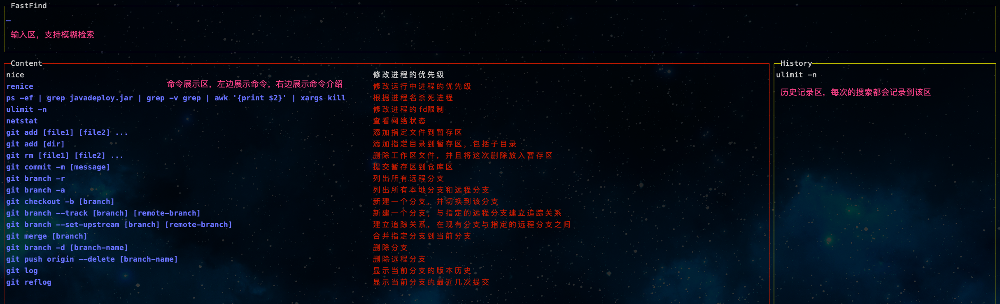
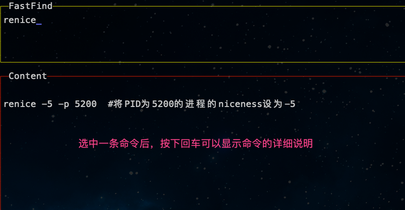
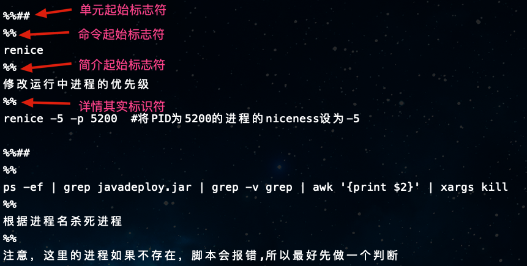

# fastfind
golang实现的命令行速查软件，辅助日常终端开发

### 安装
下载对应的release版本 tar包，然后执行install.sh脚本即可。

### 使用方法

fastfind有三个区域，输入区和展示区和历史命令区。

在终端输入fastfind后界面如下：

用户在输入区输入内容，展示区会显示相关的内容，可以使用上下键进行选择。按下回车后可以显示命令的详细信息。

支持历史记录，使用左右方向键在展示区和历史命令区跳转，上下键选择。

### 快捷键

ctrl + r: 更新记录文件后热加载

Esc: 快速清空输入区

### 记录文件

fastfind会从~/.files目录下读取全部的记录文件，记录文件以特殊的符号标识出不同的段落，每个文件内容具体如下：

